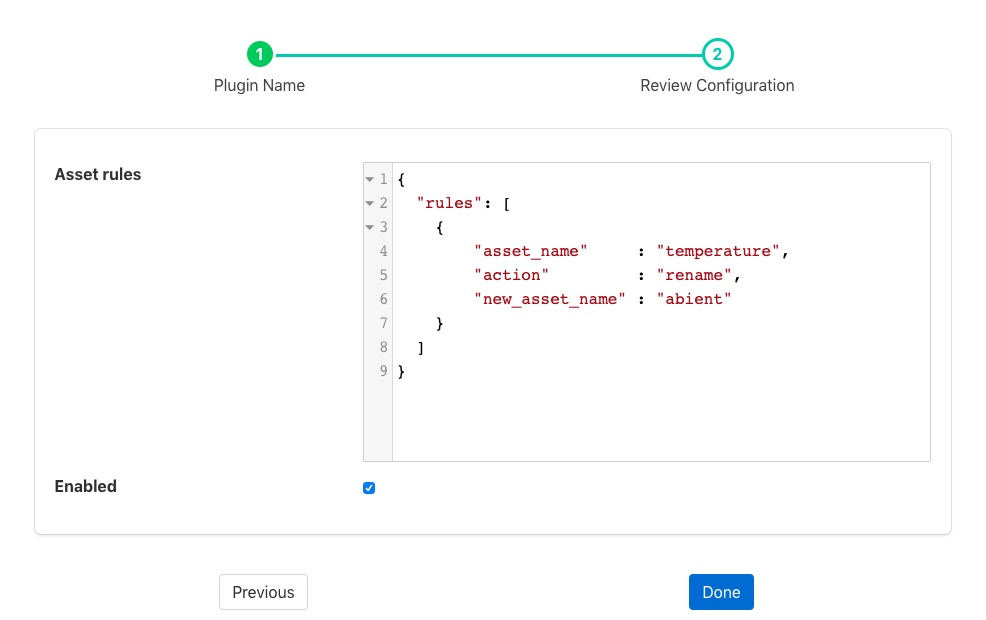

.. Images

Asset Filter
============

The *fledge-filter-asset* is a filter that allows for assets to be included, excluded or renamed in a stream. It may be used either in *South* services or *North* tasks and is driven by a set of rules that define for each named asset what action should be taken.

Asset filters are added in the same way as any other filters.

  - Click on the Applications add icon for your service or task.

  - Select the *asset* plugin from the list of available plugins.

  - Name your asset filter.

  - Click *Next* and you will be presented with the following configuration page

+---------+
| |asset| |
+---------+

  - Enter the *Asset rules*

  - Enable the plugin and click *Done* to activate it

Asset Rules
-----------

The asset rules are an array of JSON objects which define the asset name to which the rule is applied and an action. Actions can be one of

  - **include**: The asset should be forwarded to the output of the filter

  - **exclude**: The asset should not be forwarded to the output of the filter

  - **rename**: Change the name of the asset. In this case a third property is included in the rule object, "new_asset_name"

  - **remove**: This action will be passed a datapoint name as an argument or a datapoint type. A datapoint with that name will be removed from the asset as it passed through the asset filter. If a type is passed then all data points of that type will be removed.
Valid data types supported are "INTEGER", "STRING", "FLOAT_ARRAY", "DP_LIST", "IMAGE", "2D_FLOAT_ARRAY", "NUMBER", "NON-NUMERIC", "FLOATING", "BUFFER", "USER_ARRAY". "FLOATING" maps to "FLOAT", "BUFFER" maps to "DATABUFFER". "NUMBER" type which removes both integer and floating point values and the "NON-NUMERIC" that removes everything except integer and floating point values, USER_ARRAY will remove both FLOAT_ARRAY and 2D_FLOAT_ARRAY datapoints. Nested will remove DP_DICT, ARRAY will remove FLOAT_ARRAY, 2D_ARRAY will remove 2D_FLOAT_ARRAY datapoints. Datapoint types are case insensitive.

  - **datapointmap**: Map the names of the datapoints within the asset. In this case a third property is included in the rule object, "map". This is an object that maps the current names of the data points to new names.

In addition a *defaultAction* may be included, however this is limited to *include* and *exclude*. Any asset that does not match a specific rule will have this default action applied to them. If the default action it not given it is treated as if a default action of *include* had been set.

A typical set of rules might be

.. code-block:: JSON

  {
	"rules": [
                   {
			"asset_name": "Random1",
			"action": "include"
		   },
                   {
			"asset_name": "Random2",
			"action": "rename",
			"new_asset_name": "Random92"
		   },
                   {
			"asset_name": "Random3",
			"action": "exclude"
		   },
                   {
			"asset_name": "Random4",
			"action": "rename",
			"new_asset_name": "Random94"
		   },
                   {
			"asset_name": "Random5",
			"action": "exclude"
		   },
                   {
			"asset_name": "Random6",
			"action": "rename",
			"new_asset_name": "Random96"
		   },
                   {
			"asset_name": "Random7",
			"action": "include"
	           },
                   {
                        "asset_name": "lathe1004",
                        "action": "datapointmap",
                        "map": {
                                "rpm": "motorSpeed",
                                "X": "toolOffset",
                                "depth": "cutDepth"
                        }
                   },
                   {
                        "asset_name": "Random6",
                        "action": "remove",
                        "datapoint": "sinusoid_7"
                   },
                   {
                        "asset_name": "Random6",
                        "action": "remove",
                        "type": "FLOAT"
                   }
        ],
	"defaultAction": "include"
  }
